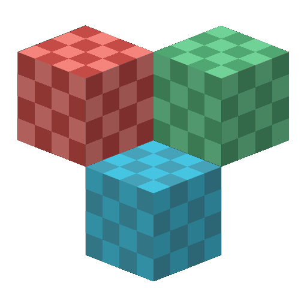

<p style="text-align: center;">
    
</p>

# zirconium
A multiplayer client for [Minecraft: Java Edition](https://minecraft.net/") written in Rust.

## Status
This project is under development and nowhere near a stable release.
Expect game-breaking bugs, sudden code refactoring, and more.

Bug reports are accepted, though! Please create an issue whenever you see an issue during testing.
If you want to fix an issue yourself or want to improve the code base, [submit a pull request](#contributing).

## Releases / Downloads
Currently, there are no stable releases. We'll release them through GitHub Releases when they are available!
You will have to [build the source code](#developing).

## Developing
Make sure your have these prerequisites installed:
* [Rust](https://www.rust-lang.org/) (Tested with stable 1.52.1)
* It is recommended to use a code editor or IDE with code completion and syntax highlighting, such as [Visual Studio Code](https://code.visualstudio.com/) or [CLion](https://www.jetbrains.com/clion/).

### Source Code
Clone the repository:
```bat
git clone https://github.com/AppleFlavored/zirconium
cd zirconium
```

### Building
When using an IDE such as CLion, create a new `Cargo` run/debug configuration.

If you are using the `cargo` command-line tool, use the following command to build the source.
```bat
cargo run --release
```

To only build, replace `run` with `build`:
```bat
cargo build --release
```

## Contributing
Anyone can submit an issue or pull request! However, there are a few rules to follow:

1. Adhere to the existing code style or [Rust Coding Conventions](https://rust-lang.github.io/api-guidelines/).
2. Ongoing work should occur in non-master branches.
3. Feedback is important! Don't be afraid to suggest changes or new ideas.

## Credits
Special thanks to the following for inspiring me to make this:

* [Stevenarella](https://github.com/iceiix/stevenarella)
* [Hematite](https://github.com/PistonDevelopers/hematite)

Also, thanks to [Recal](https://github.com/Recal) for motivating me :heart:.